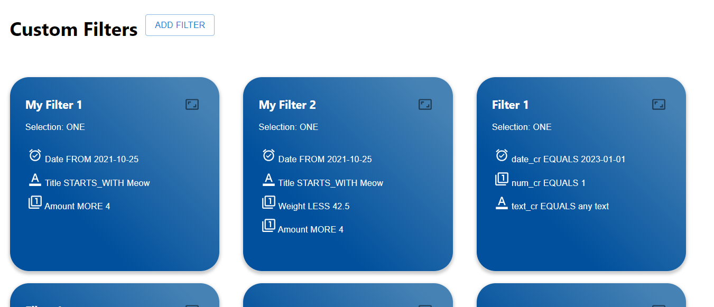
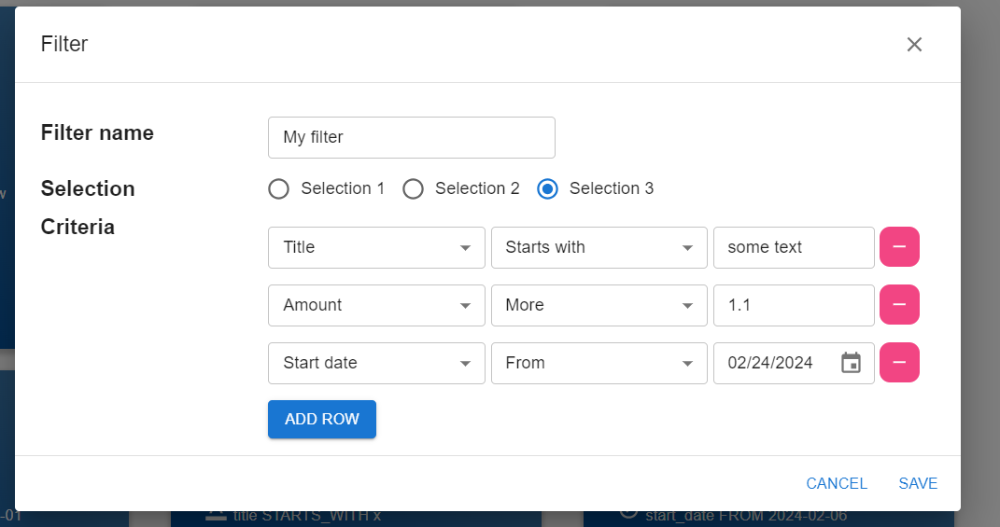

# Wisercar Filter Application

## Filter API
This API provides endpoints for managing filters. In the scope of test assignment two functionalities implemented:
retrieve filters and save new one.





### Base URL
The base URL for all endpoints is `/api/v1/filters`.
### Endpoints
1. Retrieve list of available filters
    * Endpoint `GET /api/v1/filters`
    * No request parameters required.
    * Response 
    ```json
   [
        {
        "name": "My Filter 1",
        "selection": "ONE",
        "criteria": [
            {
                "title": "Date",
                "type": "DATE",
                "value": "2021-10-25",
                "condition": "FROM"
            },
            {
                "title": "Title",
                "type": "TEXT",
                "value": "Meow",
                "condition": "STARTS_WITH"
            },
            {
                "title": "Amount",
                "type": "NUMBER",
                "value": "4",
                "condition": "MORE"
            }
        ]
      },
      {
        "name": "My Filter 2",
        "selection": "ONE",
        "criteria": [
            {
                "title": "Date",
                "type": "DATE",
                "value": "2021-10-25",
                "condition": "FROM"
            },
            {
                "title": "Title",
                "type": "TEXT",
                "value": "Meow",
                "condition": "STARTS_WITH"
            },
            {
                "title": "Weight",
                "type": "NUMBER",
                "value": "42.5",
                "condition": "LESS"
            },
            {
                "title": "Amount",
                "type": "NUMBER",
                "value": "4",
                "condition": "MORE"
            }
        ]
      }
   ]
   ```
2. Save new filter settings
    * Endpoint `POST http://localhost:8080/api/v1/filter`
    * Request body
   ```json

    {
        "name": "Filter 1",
        "selection": "ONE" ,
        "textCriteria": [
             {
                "title": "text_cr",
                "value": "any text",
                "condition": "EQUALS"
             }
         ],
        "numberCriteria": [
             {
                "title": "num_cr",
                "value": 1.01,
                "condition": "EQUALS"
             }
         ],
        "dateCriteria": [
             {
                "title": "date_cr",
                "value": "2023-01-01",
                "condition": "EQUALS"
            }
         ]
    }
    ```
   * Filter `name` and `selection` are mandatory 
   * One of criteria is mandatory to set: textCriteria, numberCriteria, dateCriteria. 
   * Criteria `title`, `value`, `condition` are mandatory and cannot be blank
   * NumberCriteria applies Integer, Double, Float values.
   * DateCriteria criteria accepts date in format yyyy-MM-dd

### Run application
    
To run application Docker should be installed.
  
Navigate to folder project: `cd /project`

Build application: `docker compose build --no-cache`

Run:`docker compose up -d`

Open in Chrome browser: ```http://localhost```

### Port usage
```
db: 5432
api: 8080
frontend: 3000
```
